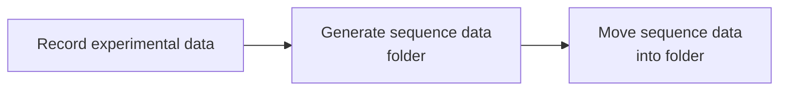
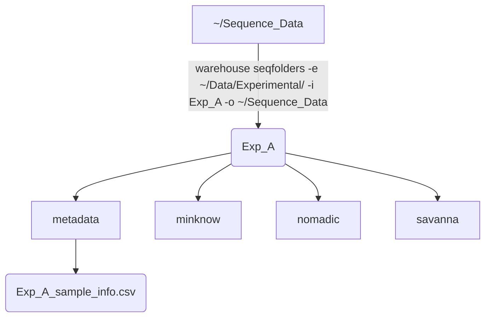
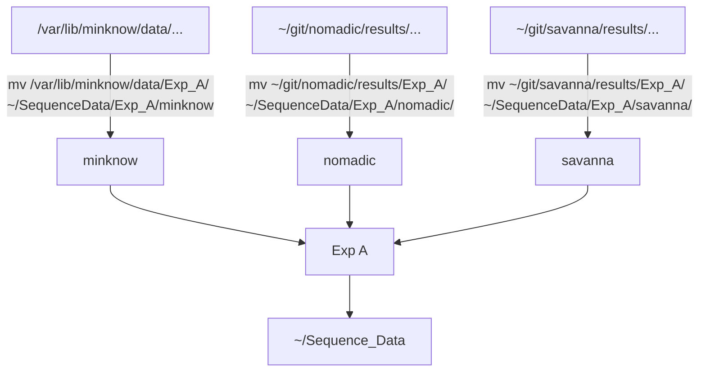
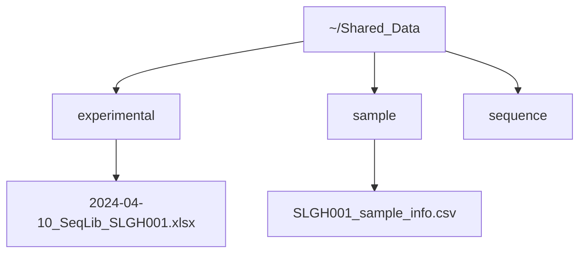

<p align="center"></p>

# Overview
This repository aims to help streamline and standardise the storage of experimental data generated from NOMADS assays. In particular, we are trying to encourage standardised:
- Experiment names
- Directory hierarchies
- Metadata files

To achieve this there are three stages to the process:

`warehouse` also has one other function - the ability to visualise experimental, sample and sequence data from multiple runs, but is only possible if data is stored as expected. 

## 1. Record Experimental Data
<details>
All experimental data is produced using a standardised Excel spreadsheets (see the `templates` folder). In every template there are user-friendly tabs for entry of data. Key user-entered data elements are then summarised in two Excel tabs / tables as follows:

- expt_metadata - experiment-wide data e.g. date of experiment
- rxn_metadata - reaction level data e.g. post-PCR DNA concentration

`warehouse metadata` can now directly import, validate, munge and export experimental data as required.

The standardisation that warehouse promotes relies on a number of identifiers:

### Experiment ID
Every experiment is given a unique ID composed of:
- Experiment type (2 letters) e.g. SW (sWGA), PC (PCR), SL (Sequence Library)
- Users initials (2 letters) e.g. Bwalya Kabale would be BW
- Three digit incremental count for each experiment type e.g. 001
The third PCR for Bwalya Kabale would therefore be PCBW003. Most of this is automatically generated through the Excel templates.

### Sample ID
Each sample must have a unique sampleID that can consist of any combination of characters. It is recommended that this should be the 'master' id assigned during sample collection and the reference for any sample metadata collected.

### Extraction ID
It is assumed that every mosquito / blood spot sample will need to have DNA extracted from it before testing. Multiple extractions may be made from a single sample therefore each needs a unique reference. It is recommended that a simple system is adopted to geenrate the extraction ID so that is can be transcribed onto tubes / plates as necessary. NOMADS recommend using a two letter prefix and then number extracts sequentially with three digits e.g. AA001, AA002 etc.

### Reaction ID
To track the movement of samples / extracts through different experiments, a unique identifier is used for each. This is composed of the experiment id and the well or reaction number e.g. the pcr_identifier for the sample tested in well A1 in PCBW003 would be `PCBW003_A1`
</details>


## 2. Generate sequence data folder hierarchy
<details>
Sequence data may be produced in multiple locations using multiple tools  pipelines. It is important that all data are appropriately stored for each sequencing run into a single folder with a standardised structure in the master folder (e.g. Sequence_Data). The standard strucure should contain these folders at a minimum:
- metadata - experimental data for each sample e.g. barcode assigned etc
- minknow - raw sequence data
- nomadic - output from `nomadic`
- savanna - output from `savanna`

A standardised folder hierarchy is generated with `warehouse seqfolders` using a completed seqlib experimental template:



Repeat as necessary for each sequencing experiment.
</details>


## 3. Aggregate sequence data
<details>
  
Assuming data has been generated using the default settings in minknow / nomadic and savanna, outputs from each will need to be moved as follows:



</details>


## 4. Other processes
<details>
  
Once all the data has been aggregated into one place, it is then easy 
1. Backup the data to an external disk drive or to a server location
2. Selectively extract summary sequence data (`warehouse extract`) for sharing online. We would recommend the shared drive consists of three folders:

- <b>experimental:</b> - containing all of the completed experimental templates
- <b>sample:</b> - csv file containing sample information e.g. date collected, parasitaemia etc, and accompanying `.ini` file (see `example_data/sample/`) defining csv fields
- <b>sequence:</b> - containing sequence summary outputs

If running Windows or Mac, the approproate Google Drive app can be installed following the website instructions. On Linux, we recommend using rclone.


For example:

Summary data can now be transferred from the Sequence_Data folder using `warehouse extract`
</details>

 
## Installation
<details>
  
#### Requirements

To install `warehouse`, you will need:
- Version control software [git](https://github.com/git-guides/install-git)
- Package manager [mamba](https://github.com/conda-forge/miniforge) 

#### Steps

**1. Clone the repository from github:**
```
git clone https://github.com/nomads-community/warehouse
cd warehouse
```

**2. Install the dependencies with mamba:**
```
mamba env create -f environments/run.yml
```

**3. Open the `warehouse` environment:**
```
mamba activate warehouse
```
**4. Install `warehouse` and remaining dependencies:**
```
pip install -e .
```
**5. Test your installation:** In the terminal, you should see available commands by typing:
```
warehouse --help
```
</details>

## Usage
<details>
  
```
Usage: warehouse.py [OPTIONS] COMMAND [ARGS]...

  NOMADS Sequencing Data - experimental outputs

Options:
  --help  Show this message and exit.

Commands:
  metadata    Extract, validate and optionally export experimental data
  seqfolders  Create appropriate NOMADS directory structure for a sequencing run
  visualise   Dashboard to visualise summary data from NOMADS assays
  extract     Copy sequence data summary outputs from nomadic and / or savanna
              into standardised hierarchy for synchronisation.

```
Each warehouse command also has a `--help` menu.

## Examples
### `metadata`
Extract and validate all experimental data from Excel files: 
```
warehouse metadata -e example_data/experimental/no_errors/ `
```
Extract and validate all experimental data from Excel files(with errors):
```
warehouse metadata -e example_data/experimental/with_errors/`
```

Extract, validate and output all experimental data:
```
warehouse metadata -e example_data/experimental/no_errors/ -o experiments/ `
```

### `seqfolders`
Create standardised directory hierarchy for sequencing run SLJS034 using default directory structure:
```
warehouse seqfolders -e example_data/experimental/no_errors -e SLJS034
```
An `.ini` file can be used to define the desired folder structure, including sub-folders (see `resources/seqfolders` for an example).

### `visualise`
View dashboard of all experimental, sample and sequence data available.
```
warehouse visualise -e example_data/experimental/no_errors/ -s example_data/seqdata/ -c example_data/sample/sample_metadata.csv
```

### `extract`
Extract sequence data summaries for sharing:
```
warehouse extract --s example_data/seqdata/ -o ~/GoogleDriveFolder/
```
</details>
